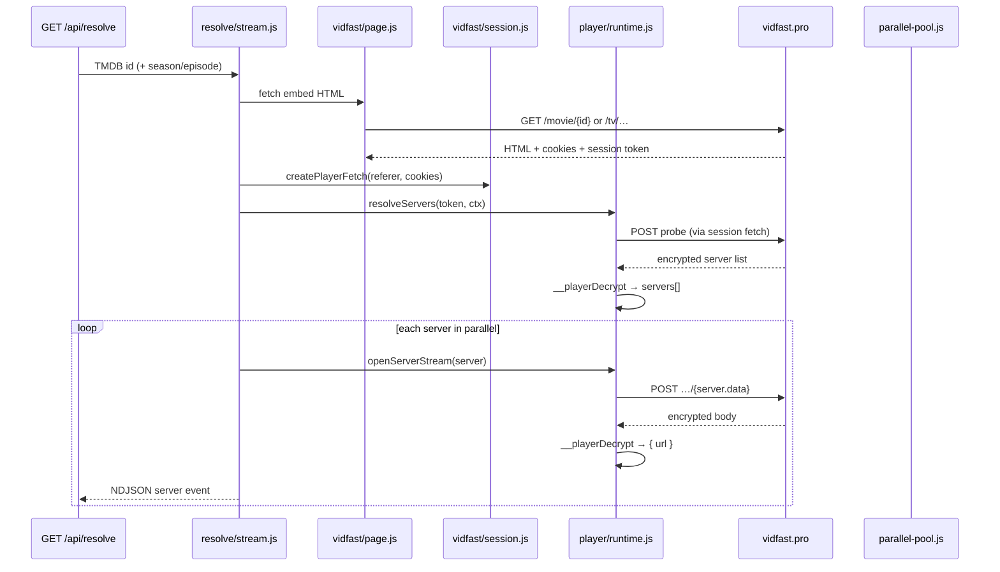
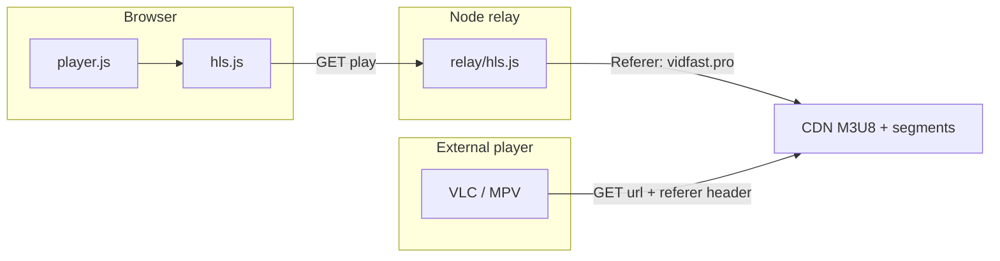

# vidfast-pro-stream-resolver

Developer-oriented HTTP resolver for [vidfast.pro](https://vidfast.pro) HLS streams. Given a TMDB movie or TV ID, it reproduces the site player’s probe/decrypt flow in Node, unlocks CDN M3U8 URLs, and exposes them through a streaming NDJSON API. A small web UI and HLS relay sit on top; the core of this codebase is the **resolve pipeline** in `src/resolve/` and `src/player/`.

```bash
npm install && npm start   # http://localhost:3000 · Node 20+
```

---

## Stream URL resolution

Vidfast does not publish a public REST API for stream URLs. The player embedded on `/movie/{id}` and `/tv/{id}/{s}/{e}` bootstraps itself, POSTs an encrypted **probe**, receives a **server list**, then POSTs per-server to obtain encrypted **stream payloads** that decrypt to `{ url }` M3U8 links.

This project runs that same client logic server-side — no Playwright, no headless Chrome.

### Resolution pipeline



### Step-by-step (code path)

| Phase | What happens | Module |
| --- | --- | --- |
| **Input** | Validate `type`, `id`, optional `season` / `episode` | `src/resolve/input.js` |
| **Page fetch** | GET embed URL, store cookies, parse session token + title/year from Next.js payload | `src/vidfast/page.js` |
| **Session fetch** | Wrap `fetch` with referer, origin, cookies, CSRF on player API paths | `src/vidfast/session.js` |
| **VM boot** | Load webpack chunks from `vendor/chunks/` into happy-dom + `node:vm`; patch bot checks | `src/player/sandbox.js`, `patch.js` |
| **Route decode** | Read API prefix + stream segment strings from bundled player constants | `src/player/runtime.js` |
| **Probe** | Call `__playerInit`; intercept probe POST body; decrypt to server array (`name`, `data`) | `src/player/runtime.js` |
| **Unlock** | For each server: POST stream path built from decoded routes + `data`; decrypt to M3U8 `url` | `openServerStream()` |
| **Emit** | Yield `meta` then each successful `server` row as NDJSON; skip failed unlocks | `src/resolve/stream.js` |

**Parallelism.** All servers unlock concurrently (`src/resolve/parallel-pool.js`). Events stream to the client as each POST completes — typically 2–3 of ~8 servers succeed per title; the rest 404 or fail decrypt and are omitted.

**Player bundle.** API paths and decrypt logic live inside vidfast’s obfuscated webpack output. We vendor three chunks (`213`, `aaea2bcf`, `365`) and patch exports at load time — no separate route config file. When vidfast updates the player, replace `vendor/chunks/` and adjust `VIDFAST_CSRF` in `src/env.js` if needed.

| Directory | Role |
| --- | --- |
| `src/resolve/` | NDJSON generator, parallel server unlock |
| `src/player/` | Webpack bundle load, probe, decrypt, stream POST |
| `src/vidfast/` | Embed fetch, cookie jar, outbound HTTP |
| `src/relay/` | HLS proxy, `play` URL builder |
| `src/http/` | `/api/resolve`, `/api/hls`, static files |
| `vendor/chunks/` | Vendored vidfast player webpack output |

---

## Playback: relay, direct URL, and VLC

Each successful unlock returns two URLs:

| Field | Value | Consumer |
| --- | --- | --- |
| `url` | Upstream CDN M3U8 | VLC, MPV, ffmpeg — anything that can set `Referer` |
| `play` | `{origin}/api/hls?url={encoded url}` | Browser (hls.js) |



### Relay (`GET /api/hls?url=`)

Implemented in `src/relay/hls.js`. The server fetches the upstream resource with `Referer` and `Origin` set to `https://vidfast.pro/`, then:

- **Playlists** — rewrite segment/variant URIs to stay on `/api/hls`
- **Segments** — pass through bytes; strip PNG-wrapped MPEG-TS when CDNs disguise transport streams
- **Response** — attach `Access-Control-Allow-Origin: *` so the browser can read the body

`play` URLs are built in `src/relay/link.js` — always proxied, no direct-browser CDN path.

### Direct URL (VLC / MPV)

External players talk to the CDN directly. They must send vidfast as referer or the CDN returns **403**:

```bash
vlc --http-referrer='https://vidfast.pro/' "<url>"
mpv --referrer='https://vidfast.pro/' "<url>"
```

No relay involved — the player handles HLS natively.

### Why the relay is required for browser playback

CDN hosts (`*.shegu.org`, `*.nexlunar99.site`, etc.) enforce referer checks and do not emit CORS headers. From a browser tab on `http://localhost:3000`:

- Direct fetch of `url` → **403**, no `Access-Control-Allow-Origin`
- hls.js cannot read the manifest or segments

From Node (relay) with `Referer: https://vidfast.pro/` → **200**. The relay is not optional for in-browser playback; it is the only path that satisfies both referer policy and CORS.

---

## API reference

### `GET /api/resolve`

NDJSON stream. One JSON object per line.

```
/api/resolve?type=movie&id=550
/api/resolve?type=tv&id=44217&season=1&episode=1
```

| Event | Fields |
| --- | --- |
| `meta` | `title`, `year` |
| `server` | `name`, `ms`, `url`, `play` |
| `error` | `stage`, `error` |

```json
{"event":"meta","title":"Fight Club","year":"1999"}
{"event":"server","server":{"name":"vEdge","ms":1200,"url":"https://…","play":"http://localhost:3000/api/hls?url=…"}}
```

Invalid params → `400` `{ "ok": false, "stage": "input", "error": "…" }`

### `GET /api/hls?url=`

Relay one upstream playlist or segment URL. Used by `play` and hls.js.

---

## Environment

| Variable | Default |
| --- | --- |
| `PORT` | `3000` |
| `HOST` | bind address when set |
| `VIDFAST_ORIGIN` | `https://vidfast.pro` |
| `USER_AGENT` | Chrome 122 desktop |
| `VIDFAST_CSRF` | CSRF token for current player bundle |

---

## Disclaimer

This project is provided for educational and research use. It is not intended to enable copyright infringement or unauthorized access to content. Users are responsible for compliance with applicable laws and third-party terms of service.
