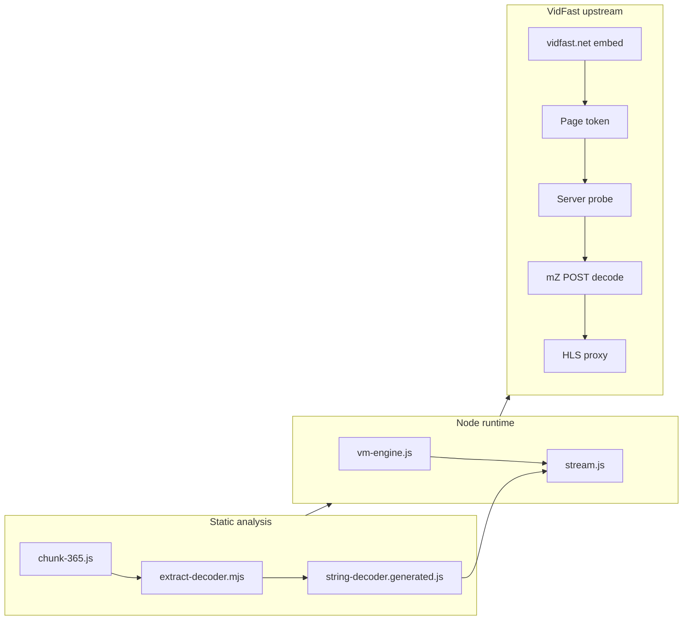

# vidfast-pro

Reverse-engineering toolkit for the [VidFast](https://www.vidfast.net) embed player. The site serves obfuscated client-side JavaScript that gates stream discovery behind string tables, environment checks, and a vendor VM. This repository recovers that pipeline in Node: static string deobfuscation from a webpack chunk, headless execution of the same VM logic, parallel upstream probing against VidFast mirrors, and an HLS rewrite proxy for local validation.

**Upstream:** [https://www.vidfast.net](https://www.vidfast.net) (override with `VIDFAST_ORIGIN`)  
**Local UI:** [http://127.0.0.1:8787](http://127.0.0.1:8787) after `npm start` (default `PORT`)

## Problem class

Typical VidFast embed protection stacks combine:

- **Chunk isolation** — `mf` / `mZ` logic lives in a numbered bundle (`assets/chunk-365.js` from the site webpack build), not the entry script on the embed page.
- **String tables** — API path segments are resolved through rotated decoders (`i3`, `i5`, `i7`) instead of plain strings.
- **Environment gates** — headless, worker, and frame checks run before server lists or decode URLs are returned.
- **HLS upstream** — `.m3u8` responses use relative segments and non-standard MPEG-TS framing (PNG-wrapped sync bytes).

Embed pages follow predictable content paths on the site, for example `/movie/{tmdbId}` or `/tv/{tmdbId}/{season}/{episode}`.

## Pipeline

| Step | Action | Output |
| --- | --- | --- |
| Static extract | Boundaries for decoder functions + rotation IIFE in chunk 365 | `tools/extract-decoder.mjs` → `lib/string-decoder.generated.js` |
| Path rebuild | `decodeString` indices for content and stream prefixes | `lib/content-path.js` |
| VM slice | Cut `mf`/`mZ` region; patch `mV`/`mA`/`mU`, crypto and DOM shims | `lib/chunk-patches.js`, `lib/vm-engine.js` |
| Headless run | `createVmRuntime()` via `new Function` with `fetch` / `Worker` stubs | `runServers`, `runDecode` |
| Probe | Concurrent POST on each server `data` slug from VidFast | `probeAvailableServers()` |
| Playback | Manifest line rewrite; strip IEND prefix before `0x47` | `lib/hls-proxy.js` |

## Architecture



## Layout

```
lib/
  vm-engine.js
  chunk-patches.js
  stream.js
  content-path.js
  hls-proxy.js
  constants.js

tools/
  extract-decoder.mjs
  resolve-stream.mjs

assets/chunk-365.js
server.mjs
public/index.html
```

## VM hosting

The extracted slice keeps vendor `mf` and `mZ` intact. Patches short-circuit sandbox heuristics (`mV`, `mA`, `mU`) and supply `crypto.randomBytes`, `Worker`, and minimal `document` / `location` bound to the VidFast origin so `runServers(en)` and `runDecode(responseText)` match browser behavior without a full DOM.

## HLS proxy

`/api/hls` rewrites non-comment playlist lines to absolute proxy URLs on the local server. Segment bodies may embed TS after a PNG `IEND` block; the proxy scans for the transport sync byte before forwarding to the player.

## Usage

Requires Node 18+.

Regenerate the string decoder after updating `assets/chunk-365.js`, resolve a title from the CLI, or use the bundled web UI:

```bash
npm run extract-decoder
npm run resolve
npm start
```

Open [http://127.0.0.1:8787](http://127.0.0.1:8787) to pick a TMDB id, probe working mirrors, decode, and play through the local HLS proxy.

CLI examples (movie and TV embed ids):

```bash
node tools/resolve-stream.mjs 1265609
node tools/resolve-stream.mjs tv 95396 1 1
```

Point at a different VidFast host (staging mirror, alternate domain):

```bash
VIDFAST_ORIGIN=https://www.vidfast.net npm run resolve
```

| Variable | Default | Role |
| --- | --- | --- |
| `VIDFAST_ORIGIN` | `https://www.vidfast.net` | Upstream site for page fetch, probes, and decode POSTs |
| `PORT` | `8787` | Local HTTP server and player UI |

| Endpoint | Role |
| --- | --- |
| `GET /` | Player UI ([http://127.0.0.1:8787](http://127.0.0.1:8787)) |
| `GET /api/stream?id=&type=movie` | Full movie resolve against VidFast |
| `GET /api/stream?id=&season=&episode=` | TV resolve against VidFast |
| `POST /api/server` | Decode one server `data` blob |
| `GET /api/hls?url=` | Proxied manifest or segment for playback |

## Scope

Authorized analysis and local testing only. Not intended to bypass access controls or [VidFast](https://www.vidfast.net) terms of service.
