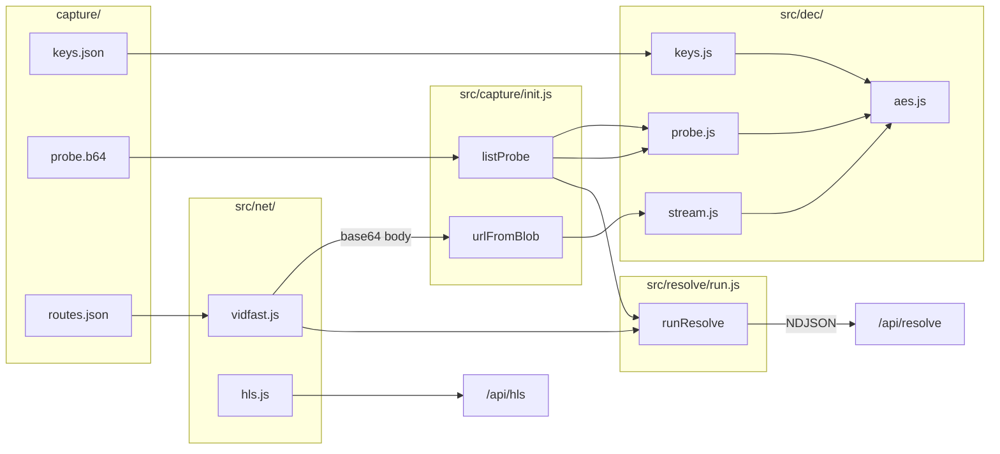

# vidfast-pro

Decrypts VidFast encrypted payloads, resolves m3u8 URLs from a TMDB content id, and exposes the result over HTTP with a web client for playback.

---

## 1. Overview

VidFast returns encrypted base64 blobs for two data types:

| Encrypted input | Plaintext output | Purpose |
| --- | --- | --- |
| `capture/probe.b64` | Server list (`name`, `data`, …) | Catalog of streaming servers |
| Stream POST response body | `{ url: "….m3u8", … }` | Direct HLS manifest URL |

Both use the same cipher and the same keys from `capture/keys.json`. The codebase decrypts them in `src/dec/`, loads keys and probe via `src/capture/init.js`, fetches stream blobs via `src/net/vidfast.js`, and orchestrates the full chain in `src/resolve/run.js`.

---

## 2. Decryption

### 2.1 Inputs and outputs

```
capture/keys.json ──► parseKeys() ──► { k1, k2, k3 }
                                           │
capture/probe.b64 ──► decProbe() ──────────┤──► [ { name, data, description, image }, … ]
                                           │
Stream POST body  ──► decStream() ─────────┘──► "https://…/index.m3u8"
```

| Ciphertext source | File on disk | Decrypt function | Module | Output |
| --- | --- | --- | --- | --- |
| Server list | `capture/probe.b64` | `decProbe(b64, keys)` | `src/dec/probe.js` | Array of server rows |
| Stream URL | VidFast POST response | `decStream(b64, keys)` | `src/dec/stream.js` | m3u8 URL string |
| Either (raw JSON) | Any base64 blob | `decJson(b64, keys)` | `src/dec/aes.js` | Parsed JSON object |

Keys are never embedded in ciphertext. They are loaded once from disk:

```
capture/keys.json ──► parseKeys() ──► src/dec/keys.js ──► { k1, k2, k3 } as Buffer
```

### 2.2 Cipher

All decrypt paths call `decJson()` in `src/dec/aes.js`.

**Implementation:** Node.js `node:crypto` — `createHash('sha256')`, `createDecipheriv('aes-256-gcm')`.

**Blob layout (after base64 decode):**

| Offset | Size | Field |
| --- | --- | --- |
| 0 | 16 | Header |
| 16 | 12 | IV |
| 28 | n | Ciphertext |
| 28 + n | 16 | Auth tag |

**Key derivation:**

```
h1  = SHA256(k1 ‖ k2 ‖ k3)
key = SHA256(h1 ‖ header)
```

**Decrypt:**

```
plain = AES-256-GCM-Decrypt(key, iv, ciphertext, tag)
json  = JSON.parse(plain.subarray(8))
```

Bytes 0–7 of plaintext are discarded before JSON parsing.

### 2.3 Module chain

```
src/dec/keys.js       parseKeys(raw)           keys.json object → { k1, k2, k3 }
        │
        ▼
src/dec/aes.js        decJson(b64, keys)       base64 blob → JSON
        │
        ├──► src/dec/probe.js   decProbe(b64, keys)   JSON → server rows
        │
        └──► src/dec/stream.js  decStream(b64, keys)  JSON → json.url
```

`src/dec/` has no filesystem or network access. Callers supply `b64` and `keys`.

### 2.4 Loader

`src/capture/init.js` reads disk artifacts and wires decrypt calls:

| Function | Reads | Calls | Returns |
| --- | --- | --- | --- |
| `warm()` | `keys.json`, `probe.b64` | `parseKeys`, caches in memory | — |
| `listProbe()` | cached probe + keys | `decProbe` | Server rows |
| `urlFromBlob(b64)` | cached keys | `decStream` | m3u8 URL |

Loaded once per process. Restart required after editing `capture/`.

---

## 3. Resolve

Resolve turns a content id into decrypted m3u8 URLs for every server in the probe list.

### 3.1 Pipeline

```
listProbe()                         decrypt probe.b64 → server rows
    │
    ▼
for each row (8 workers):
    postStream(row.data, pagePath)  POST to VidFast → base64 body
    urlFromBlob(b64)                decrypt body → m3u8 URL
    │
    ▼
yield NDJSON events                 meta → server → done
```

### 3.2 Content paths

| Query `type` | Path built |
| --- | --- |
| `movie` | `/movie/{id}` |
| `tv` | `/tv/{id}/{season}/{episode}` |

Built in `src/resolve/run.js` from `URLSearchParams`. Used as the `Referer` suffix on stream POST.

### 3.3 Stream POST

`src/net/vidfast.js` → `postStream(data, page)`

**Reads:** `capture/routes.json`

**Request:**

```
POST {origin}/{probePrefix}/{streamPrefixB}/{data}
Referer: {origin}{page}
Origin:  {origin}
+ csrfHeaders, User-Agent
Timeout: 2500 ms
```

**Returns:** trimmed base64 ciphertext, or `null` on failure / JSON error body.

That base64 string is the input to `urlFromBlob()` → `decStream()` → `decJson()`.

### 3.4 Concurrency

`src/resolve/pool.js` runs up to 8 parallel `postStream` + decrypt jobs. Results yield in completion order. Duplicate m3u8 URLs are skipped. Failed POST or decrypt returns `null` for that server only.

### 3.5 Server result object

Produced by `src/resolve/run.js`:

| Field | Source |
| --- | --- |
| `name`, `description`, `image`, `data` | Probe row |
| `streamUrl` | `decStream` output |
| `playbackUrl` | `{origin}/api/hls?url={encodeURIComponent(streamUrl)}` |

---

## 4. HTTP server

**Entry:** `npm start` → `src/srv/http.js`  
**Port:** `8787` (env `PORT`)

| Route | Module used | Action |
| --- | --- | --- |
| `GET /api/resolve` | `src/resolve/run.js` | Stream NDJSON resolve events |
| `GET /api/hls?url=` | `src/net/hls.js` | Proxy HLS manifest or segment |
| `GET /` | — | Serve `public/index.html` |

Startup calls `warm()` to preload `capture/` into memory.

### 4.1 `/api/resolve`

**Query:** `id` (required), `type` (`movie`|`tv`), `season`, `episode`

**Response:** `application/x-ndjson`

| Event | Payload |
| --- | --- |
| `meta` | `{ type, contentPath, total }` |
| `server` | `{ server: { name, streamUrl, playbackUrl, … } }` |
| `done` | `{ servers: [...] }` |
| `error` | `{ error }` (mid-stream only) |

### 4.2 `/api/hls`

Does not decrypt. Fetches upstream HLS with VidFast referrer headers.

| Response type | Behavior |
| --- | --- |
| `.m3u8` manifest | Rewrite segment URLs to loop through `/api/hls` |
| Segment bytes | Strip PNG wrapper if present; return MPEG-TS |

---

## 5. Web client

**File:** `public/index.html`

| Dependency | Source |
| --- | --- |
| hls.js 1.5.15 | jsDelivr CDN |

| Action | API used |
| --- | --- |
| Fetch streams | `GET /api/resolve` — reads NDJSON stream |
| Play video | `GET /api/hls` via `server.playbackUrl` |
| Switch server | Changes `playbackUrl` on `<video>` / hls.js instance |

Link panel exports `streamUrl` (direct), `playbackUrl` (proxy), and mpv/vlc commands with `Referer: https://vidfast.pro/`.

---

## 6. Configuration

All runtime config lives in `capture/`.

### keys.json

```json
{ "stream": { "k1": "<hex>", "k2": "<hex>", "k3": "<hex>" } }
```

Used by: `src/capture/init.js` → `src/dec/keys.js` → all decrypt functions.

### probe.b64

Base64 ciphertext of the server list. Used by: `listProbe()` → `decProbe()`.

### routes.json

```json
{
  "origin": "https://vidfast.pro",
  "probePrefix": "/…/x",
  "streamPrefixB": "…",
  "csrfHeaders": {}
}
```

Used by: `src/net/vidfast.js` only. Not involved in decryption.

---

## 7. Architecture



---

## 8. Project structure

```
capture/                  Keys, encrypted probe, API routes
public/index.html         Web client
src/
  dec/                    Decrypt layer (keys → aes → probe | stream)
  capture/init.js         Load capture/ ; listProbe ; urlFromBlob
  net/vidfast.js          Stream POST to VidFast
  net/hls.js              HLS CDN proxy
  resolve/run.js          Resolve orchestration
  resolve/pool.js         Worker pool
  srv/http.js             HTTP entry point
package.json              npm start → node src/srv/http.js
```

---

## 9. Stack

| | |
| --- | --- |
| Runtime | Node.js 18+ |
| Modules | ESM |
| npm packages | None |
| Node built-ins | `crypto`, `http`, `fs`, `path`, `url`, `buffer` |
| Browser | hls.js (CDN) |

---

## 10. Usage

**Server**

```bash
npm start
```

**Resolve (curl)**

```bash
curl -N 'http://127.0.0.1:8787/api/resolve?id=550&type=movie'
```

**Decrypt (programmatic)**

```js
import { warm, listProbe, urlFromBlob } from './src/capture/init.js'

warm()
const servers = listProbe()
const url = urlFromBlob('BASE64_FROM_STREAM_POST')
```

**Resolve (programmatic)**

```js
import { runResolve } from './src/resolve/run.js'

for await (const evt of runResolve(new URLSearchParams({ id: '550' }), 'http://127.0.0.1:8787')) {
  console.log(evt)
}
```

**Environment**

| Variable | Default |
| --- | --- |
| `PORT` | `8787` |
